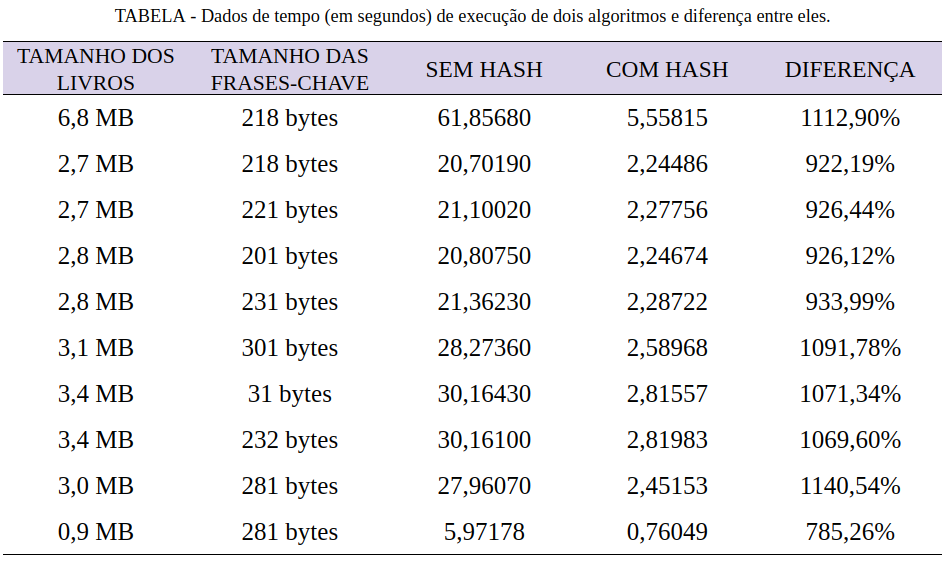

## OBJETIVOS

O trabalho consiste na implementação de um sistema de ranqueamento de documentos utilizando o algoritmo TF/IDF (Term Frequency-Inverse Document Frequency). O objetivo principal é classificar um conjunto de documentos de acordo com a relevância de cada um em relação a frases de pesquisa específicas, utilizando a métrica TF/IDF para calcular essa relevância.

### Algoritmo TF/IDF

O TF/IDF é uma técnica amplamente utilizada em recuperação de informações e mineração de texto. Ele combina duas medidas:

- **TF (Term Frequency)**: Mede a frequência de um termo em um documento, indicando a importância do termo dentro daquele documento específico.
- **IDF (Inverse Document Frequency)**: Avalia a importância de um termo em relação a todo o conjunto de documentos, penalizando termos que aparecem em muitos documentos, pois eles tendem a ser menos informativos.

### Objetivo do Trabalho

1. Ler e processar documentos de texto.
2. Calcular a relevância de cada documento em relação a uma lista de frases de pesquisa, utilizando a métrica TF/IDF.
3. Classificar os documentos de acordo com essa relevância, utilizando métodos de ordenação eficientes.

### Tipo de Entrada

O sistema receberá como entrada:

1. Um conjunto de arquivos de texto contendo documentos aleatórios.
2. Uma lista de frases de pesquisa, onde cada frase será comparada aos documentos para determinar a relevância de cada um.
3. 
## Implementação e Estruturas de Dados

Para modelar o trabalho em questão, optou-se por duas abordagens distintas, com o objetivo de realizar um estudo completo sobre o impacto das estruturas de dados na eficiência de um programa. Inicialmente, implementaram-se os cálculos de busca TF/IDF utilizando estruturas mais complexas, como **tabelas hash**, para implementar o algoritmo de busca com melhor eficiência. Em um segundo momento, utilizou-se uma abordagem alternativa, com estruturas de dados mais simples, como Fila e `vector` em C++, a fim de comparar o desempenho e compreender melhor os impactos no custo computacional.

A seguir, serão apresentadas as duas abordagens, incluindo a descrição das estruturas de dados utilizadas em cada caso, assim como considerações sobre o custo computacional de cada abordagem e uma análise das vantagens e desvantagens encontradas no uso de cada estrutura.

### Implementação com Tabelas Hash
 
Inicalmente, para modelar o trabalho em questão, de forma a obter a melhor performance possível, foram utilizadas diversas estruturas de dados abordadas na disciplina de Algoritmos e Estruturas de Dados I. Foram empregadas, em sua maioria, estruturas de dados complexas ou de segunda ordem, ou seja, diferentes das estruturas primárias. Em cada etapa da implementação, foram usadas estruturas que melhor modelassem o problema a ser resolvido, e, em diferentes etapas, estruturas semelhantes foram usadas para resolver problemas distintos. Sendo assim, para cada etapa da solução, serão apresentadas as estruturas empregadas, exemplificando da melhor maneira possível a solução implementada.

### Leitura de Palavras

Como a entrada deste trabalho, tanto as frases quanto os documentos a serem ranqueados, estão em formato de arquivos `.txt`, é necessário ser capaz de acessar cada palavra de maneira eficiente. Para isso, todas as palavras a serem pesquisadas (**keywords**), após serem lidas do arquivo, foram armazenadas em um **unordered_set**, permitindo acesso rápido e eficiente. Isso porque o **unordered_set** oferece busca em tempo constante, O(1), em comparação ao **vector**, cuja busca tem custo linear, O(n). Esse ganho de performance é essencial quando lidamos com grandes volumes de dados.

### Contagem de Palavras

Para abordar corretamente o problema apresentado, primeiramente é necessário realizar a normalização dos textos presentes em cada documento. Para isso, é preciso eliminar todas as palavras que geralmente não alteram o sentido do texto. Essas palavras são as chamadas "stop words", como: "a", "as", "que", "da", "de", entre outras. Durante esse processo, é necessário contar as palavras relevantes em cada documento. Para cada documento, foi utilizada uma estrutura do tipo **Hash Table**, ou **unordered_map** em C++, para auxiliar na contagem. Como as **Hash Tables** possuem custo de acesso em tempo constante, O(1), elas são uma excelente escolha para atribuir a um índice específico o número de ocorrências de cada palavra.

Durante a iteração sobre as palavras no documento, cada uma é alocada na tabela. Sempre que uma palavra se repete, seu índice é acessado e o valor correspondente é incrementado. Dessa forma, após percorrer todo o documento, temos todas as palavras contadas e armazenadas na tabela, junto com a quantidade de vezes que se repetem.

Essa abordagem resolve o problema para um único documento, mas é necessário expandir a solução para processar vários documentos. Assim, a estrutura final para realizar essa tarefa foi um array, **vector** em C++, de tabelas hash, onde cada posição do array representa as palavras processadas em um documento. O resultado final é uma estrutura que permite acessar todas essas informações de maneira eficiente.

<a href="https://github.com/joaopaulocunhafaria/Faculdade/blob/dd1c6e58b73d0b8b527b2f6da8990a175572fc0b/AEDS%20II/TF-IDF/src/processBooks.hpp#L22"> Acesse a declaração no código </a>

 

### Cálculo TF (Term Frequency)

Cada palavra a ser ranqueada usando o algoritmo TF-IDF possui um valor de **Term Frequency** (TF) para cada documento. Portanto, é necessário que exista uma estrutura que armazene, para cada palavra, seus valores de **Term Frequency** em cada documento. Para modelar essa etapa, novamente foram utilizadas tabelas hash. Porém, nesta etapa, ao invés de armazenar a contagem de ocorrências de uma palavra, armazenamos um array que contém os valores de **Term Frequency** para cada documento.

O resultado final é uma tabela hash onde a chave é a palavra, e o valor é um array. Cada posição do array contém o valor de **Term Frequency** para essa palavra em um documento específico. Os documentos seguem a ordem dos índices do array, ou seja, a primeira posição do array corresponde ao documento 1.

<a href="https://github.com/joaopaulocunhafaria/Faculdade/blob/dd1c6e58b73d0b8b527b2f6da8990a175572fc0b/AEDS%20II/TF-IDF/src/tfIdf.hpp#L15"> Acesse a declaração no código </a>
 

### Cálculo IDF (Inverse Document Frequency)

O cálculo do **Inverse Document Frequency** (IDF) é mais simples, pois cada palavra possui apenas um valor de IDF. Isso permite uma modelagem mais direta. Inicialmente, considerou-se a possibilidade de usar estruturas do tipo **Tuple** para essa etapa. No entanto, como será necessário acessar os valores de IDF posteriormente, **Tuples** não são a melhor opção, pois a busca dentro de um array de **Tuples** tem custo O(n). Por outro lado, o uso de tabelas hash oferece tempo de acesso constante, O(1).

Assim, os valores resultantes dos cálculos de **Inverse Document Frequency** para cada palavra foram armazenados em uma tabela hash, onde as chaves são as palavras e os valores são os resultados dos cálculos de IDF. Essa abordagem permite acesso rápido e eficiente a essas informações.

<a href="https://github.com/joaopaulocunhafaria/Faculdade/blob/dd1c6e58b73d0b8b527b2f6da8990a175572fc0b/AEDS%20II/TF-IDF/src/tfIdf.hpp#L18"> Acesse a declaração no código </a>
  
### Cálculo de Relevância TF/IDF

Finalmente, para termos acesso ao ranking que cada palavra possui em cada documento, é necessário realizar o cálculo proposto pelo algoritmo TF/IDF. Esse cálculo se baseia em multiplicar o TF **(Term Frequency)** de uma palavra em relação a determinado documento pelo seu IDF  **(Inverse Document Frequency)**  em relação à totalidade dos documentos.

Para armazenar essas informações, utilizou-se uma estrutura semelhante à empregada para armazenar apenas o TF  de cada palavra, uma vez que cada palavra terá um array contendo seu ranking para cada documento, semelhante ao valor de TF. Portanto, foi utilizada novamente uma tabela hash, contendo cada keyword como chave e um array com os resultados dos cálculos TF/IDF como valor.

Foi utilizado um vector para armazenar os valores, pois, apesar de ter um tempo de acesso pior quando comparado a outras opções possíveis, seu uso permite que os índices representem diretamente o ranking de cada documento. Dessa forma, de maneira semelhante à estrutura usada para armazenar os valores de TF, cada índice do array representa o ranking do respectivo documento. Ou seja, o primeiro valor do array corresponde ao ranking do documento 1, e assim sucessivamente.

<a href="https://github.com/joaopaulocunhafaria/Faculdade/blob/dd1c6e58b73d0b8b527b2f6da8990a175572fc0b/AEDS%20II/TF-IDF/src/tfIdf.hpp#L22"> Acesse a declaração no código </a>

### Implementação com Filas e Structs

Em um segundo momento, implementou-se uma solução baseada no uso de Filas e Structs, para que fosse possível analisar o comportamento do algoritmo ao trabalhar com estruturas limitadas. Para viabilizar uma solução que atendesse minimamente aos requisitos propostos, foi necessário criar estruturas personalizadas auxiliares. A seguir, apresentaremos como essas estruturas foram criadas e modeladas para melhor cumprir seu papel, além dos contextos em que se mostraram necessárias.

### Leitura de Palavras

O processo de leitura de palavras provenientes dos arquivos de entrada, bem como do arquivo que contém as **stopWords**, foi a primeira etapa em que o uso de estruturas de dados mais sofisticadas impactou negativamente o desempenho do algoritmo. Dessa vez, utilizou-se estruturas do tipo Fila para armazenar as palavras a serem usadas posteriormente. Essa decisão teve grande impacto, pois nos processos seguintes, todas as vezes que se desejava buscar nesta base de palavras, o custo era \(O(n)\), ao invés de constante, como explicado anteriormente.

### Contagem de Palavras

Durante o processo de contagem de palavras, foi necessário abrir mão de estruturas tradicionais e, para modelar o problema da melhor forma possível com opções limitadas, recorreu-se ao uso de **Structs** em C++. O objetivo era simular uma estrutura de *<Chave, Valor>*, onde a chave representaria cada palavra e o valor, a quantidade de vezes que essa palavra aparece em um determinado arquivo. No entanto, de forma semelhante à implementação que usa tabelas hash, essa abordagem resolve a contagem para apenas um arquivo. Assim, foi necessário criar uma estrutura que simulasse uma matriz, onde cada linha representasse o enésimo documento e cada coluna, uma determinada palavra.

A estrutura utilizada para modelar essa etapa foi um `vector` de `vectors`, onde cada `vector` armazena elementos do tipo `PalavraContagem`, um objeto que contém uma `string` e um contador.

<a href="https://github.com/joaopaulocunhafaria/TF-IDF/blob/d933888e9790b118c9f6f1d3f83fe725b1a83148/filas_pilhas/src/processBooks.hpp#L23"> Acesse a declaração no código </a>    

### Cálculo TF (Term Frequency)

Para o cálculo de **Term Frequency (TF)**, utilizou-se uma abordagem semelhante, sendo necessário criar uma estrutura personalizada para modelar esta etapa. A situação exigiu uma estrutura um pouco diferente da modelada anteriormente, pois os valores armazenados na **Struct** seriam um conjunto de *<Chave, Valor>*; no entanto, desta vez, os valores armazenados foram uma Fila de `doubles`, onde cada elemento representa o cálculo de **TF** referente a uma palavra (chave da **Struct**). Houve novamente uma perda de desempenho no algoritmo devido à ausência das tabelas hash, que garantiriam uma maior eficiência.

Além da queda de desempenho, a utilização de estruturas menos eficientes também exigiu uma maior quantidade de código, aumentando a complexidade da solução apresentada. Por exemplo, foi necessário implementar funções para percorrer todo o `vector` que contém as Structs e retornar o índice de um valor presente ou -1, caso a palavra não estivesse presente.

A estrutura utilizada para modelar essa etapa foi um `vector` de elementos do tipo `PalavraTf`, um objeto que contém uma `string` como chave e uma Fila de `doubles` como valor.

[Acesse a declaração no código](https://github.com/joaopaulocunhafaria/TF-IDF/blob/d933888e9790b118c9f6f1d3f83fe725b1a83148/filas_pilhas/src/tfIdf.hpp#L32)

### Cálculo IDF (Inverse Document Frequency)

De forma semelhante, o cálculo de **Inverse Document Frequency (IDF)** também exigiu a criação de uma **Struct** que armazena uma palavra e um valor do tipo `double` para representar o valor de **IDF** referente a essa palavra. Compilou-se esses elementos em uma Fila para garantir acesso a todos os valores armazenados. É importante destacar que, para este processo, foi necessário implementar outra função de busca no `vector`, uma vez que a **Struct** usada é diferente da anterior e, portanto, não permite o uso do mesmo método. Isso trouxe mais complexidade à solução e aumentou o custo computacional devido à ausência de tabelas hash.
 

[Acesse a declaração no código](https://github.com/joaopaulocunhafaria/TF-IDF/blob/d933888e9790b118c9f6f1d3f83fe725b1a83148/filas_pilhas/src/tfIdf.hpp#L34)

### Fluxograma
O percurso do algoritmo passa pelos arquivos **main** (inicializador do programa), **processBook** (que processa o conteúdo dos livros na pasta datasets) e **tfidf** (responsável por realizar os cálculos TF/IDF). 
1. **main**: o `main` é responsável por chamar o construtor `processBook` e inicializar o programa com a função `run`; também é responsável por informar quantos livros serão processados.
2. **processBook**: A classe `ProcessBook`, localizado no arquivo `processBook`, consiste em um construtor e funções para o processamento e variáveis globais. Ele tem como objetivo de fazer as manipulaçãoes e processar os documentos. 
  - **`processBook()`**: construtor responsável por salvar, em `booksQuantity`, a quantidade de livros que será processada.
  - **`run()`**: função responsável por inicializar e controlar as etapas para o processamento das palavras dos arquivos.

         void ProcessBooks::run()
           this->stopWords = processStopWords();
           this->wordsInDocument = processWords();
           TfIdf tfIdf = TfIdf(); 
           tfIdf.run(wordsInDocument);
         }
     
- **`processStopWords()`**: função responsável pela leitura das palavras que têm menos relevância para o processamento.
- **`processWords()`**: função responsável pela leitura dos livros, sendo que ela realiza a normalização das palavras. Ou seja, o texto é lido e tratado, em `processLine()`, para remover qualquer sinal de pontuação e acentuação. Além disso, essa função é responsável por excluir as palavras menos relevantes que foram lidas em `processStopWords()`.

*O construtor `TfIdf()` e a função `TfIdf::run()`, que estão em `processBook::run()`, são responsáveis por instanciar e executar a classe `TfIdf`.*

3. **tfidf**: A classe `IfIdf` localizado no arquivo `tfidf`, tem como objetivo de classificar o conjunto de documentos(livros) de acordo com a relevância de cada um em relação a frases de pesquisa específicas, utilizando a métrica TF/IDF para calcular essa relevância:
 - **`IfIdf()`**: Construtor vazio de inicialização.
 - **`run()`**: função responsável de controlar as etapas para o processo de classificação. 

       void TfIdf::run(vector<unordered_map<string, int>> wordsInDocs){
           this->keyWords = processKeyWords();
           this->idfRank = idf(wordsInDocs);
           this->tfRank = tf(wordsInDocs);
           this->wordsScore = calculateTfIdf();
           this->lineScore = calculateScore();
           showScore();
       },

- **`processKeyWords()`**: função responsável pela leitura das palavras-chave que serão usadas para a classificação. Além disso, também é responsável por normalizar o texto lido, removendo pontuações e acentuações com a ajuda da função `processLine`.
- **`idf()`**: função responsável por calcular o IDF de cada palavra-chave no conjunto de documentos.
- **`tf()`**: função que calcula o TF, medindo a frequência relativa de uma palavra em relação ao número total de palavras em um documento.
 - **`calculateTfIdf()`**: calcular o TF-IDF de cada palavra em um conjunto de documentos. 
 - **`calculateScore()`**: O objetivo é calcular uma pontuação agregada para um conjunto de palavras e seus respectivos valores de pontuação , somando vetores de pontuação em `calculateScore` usando a função `sumVector()`.
- **`showScore()`**: Esta função exibe a relevância de cada frase em relação aos documentos, listando-os em ordem decrescente de relevância com base nas pontuações armazenadas em `lineScore`. Ela utiliza a função `sortedIndices` para classificar os documentos e apresenta os resultados de forma clara.

### Diferença de Algoritmo com Tabela Hash e Filas e Pilhas

O tipo de manipulação de dados é fundamental para a performance geral do algoritmo, como é demonstrado na tabela abaixo. A primeira coluna, "SEM HASH", representa o algoritmo baseado em filas e pilhas (FP), que teve um tempo de execução superior em relação à segunda coluna, "COM HASH", que mostra um algoritmo com tabela hash. A diferença varia de aproximadamente 186% a 1086%. Isso demonstra que a utilização da tabela hash é mais eficiente na resolução do problema inicial, que é calcular o TF/IDF.

Para a coleta de dados (o tempo de execução de cada algoritmo), foram utilizados 60 livros/textos diferentes, assim como as palavras-chave, que foram extraídas desses próprios textos.

## COMPILAÇÃO E EXECUÇÃO 

| Comando     | Função                                                                 |
| ----------- | ---------------------------------------------------------------------- |
| make clean  | Apaga a última compilação realizada contida na pasta build              |
| make        | Executa a compilação do programa utilizando o gcc, e o resultado vai para a pasta build |
| make run    | Executa o programa da pasta build após a realização da compilação       |
